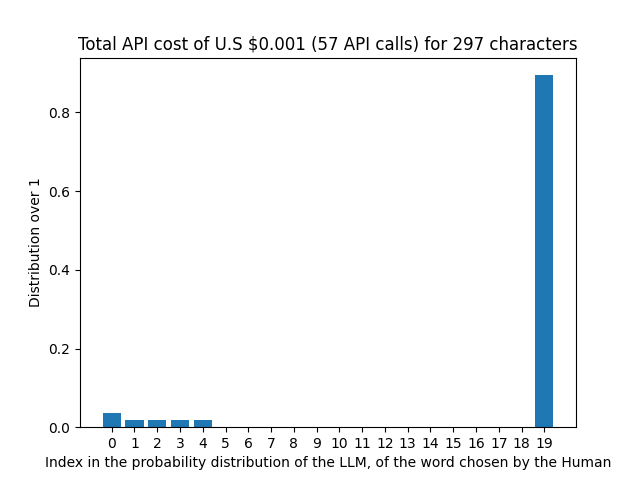
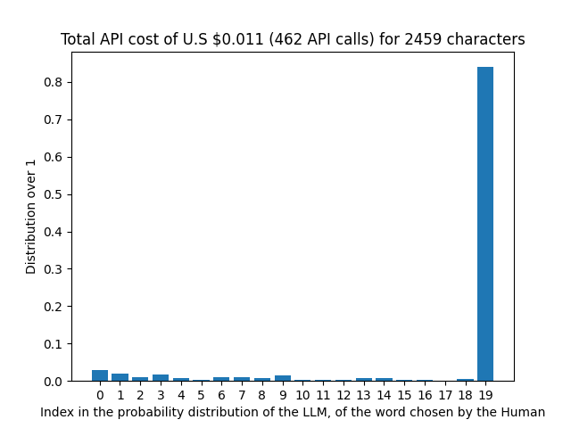
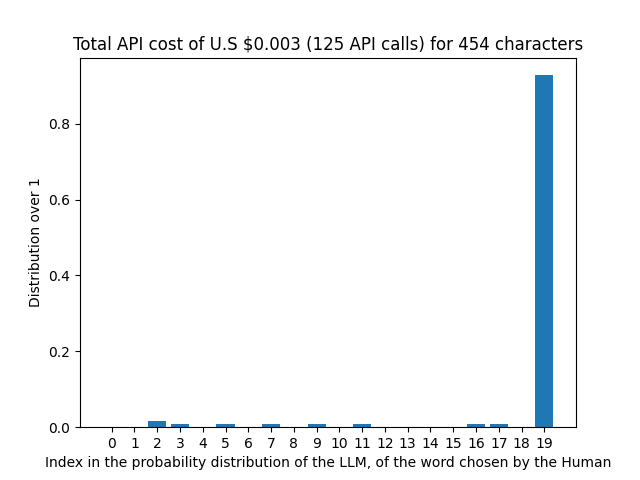
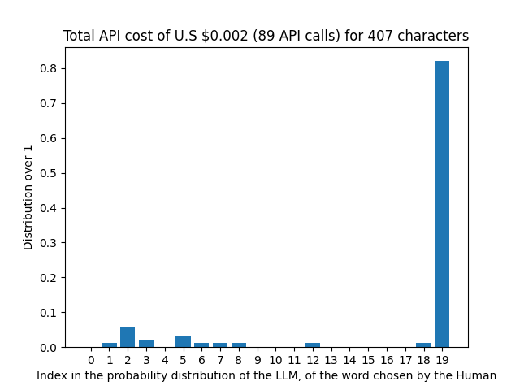

# LLM Watermarking

This repository contains prototype code to evaluate a novel technique to identify text written by Large Language Models.

It will illustrate the frequency with which a human chooses a word based on its position in the probability distribution generated by a LLM. The x-axis represents the rank or position of the word chosen by the human in the probability distribution generated by the LLM. For example, based on the previous sequences of tokens in the same document, if the human chose a token that the LLM predicted as the 7th most probable token, it falls into bin 6. This axis shows the number of times the human chose a word from each rank in the LLM's probability distribution. Higher bars indicate a higher frequency of words chosen from that rank. All tokens not present in the log probability distribution returned by the model API, are placed in the last frequency bin.

The default Sequence Window size is of 10, which implies that each iteration considers at most 10 of the previous tokens.

## Get Started

1. Create and activate a Python virtual environment to install all dependencies

```bash
python -m venv ./venv/
source ./venv/bin/activate
pip install -r ./requirements.txt
```

2. Specify your Open AI API key

```bash
echo GPT_API_KEY="<OPENAI_API_KEY>" > .env
```

3. Execute the program by defining the Text file you wish to evaluate and the model for which you want to compare the token selection distribution

```bash
python prototype.py --help

usage: prototype.py [-h] input_file_name open_ai_model_id [context_window] [frequency_bins]

Watermarking LLMs.

positional arguments:
  input_file_name   Path to the input text file.
  open_ai_model_id  The ID of the judge LLM, as specified by the OPEN AI API documentation:
                    https://platform.openai.com/docs/models. Supported models are
                    'davinci-002' and 'baggage'.
  context_window    The context window size (an integer). Defaults to 10.
  frequency_bins    The number of bins to consider in the frequency distribution. Defaults to
                    20.

options:
  -h, --help        show this help message and exit
```

## Examples

Based on the use of different Judge LLMs.

### Using ```davinci-002```

Short human-generated text (```./data/human-input-small.txt```):


- Human generated text (```./data/human-input.txt```):


- GPT-4o generated text ( ```./data/gpt4o-input.txt```):


- Davinci-002 generated text ( ```./data/davinci-002-input.txt```):


### Using ```gpt3.5-turbo-1106```

Short human-generated text (```./data/human-input-small.txt```):



- Human generated text (```./data/human-input.txt```):



- GPT-4o generated text ( ```./data/gpt4o-input.txt```):



- Davinci-002 generated text ( ```./data/davinci-002-input.txt```):



## Cost Analysis


## Evaluation Data

Evaluation data is either generated by a human being during the pre-LLM era or by an LLM, as indicated by the suffix of the files located in the ```./data/``` folder.

For instance, ```./data/gpt4o_input.txt```, indicates a text file written by the GPT-4o model.

## Future Work:

- [ ] Implementation rather slow, implement paralised execution.

- [ ] Current Results are insignificant. The experiments shall be conducted on a larger dataset while introducing a quantitative metric describing the obtained distribution.